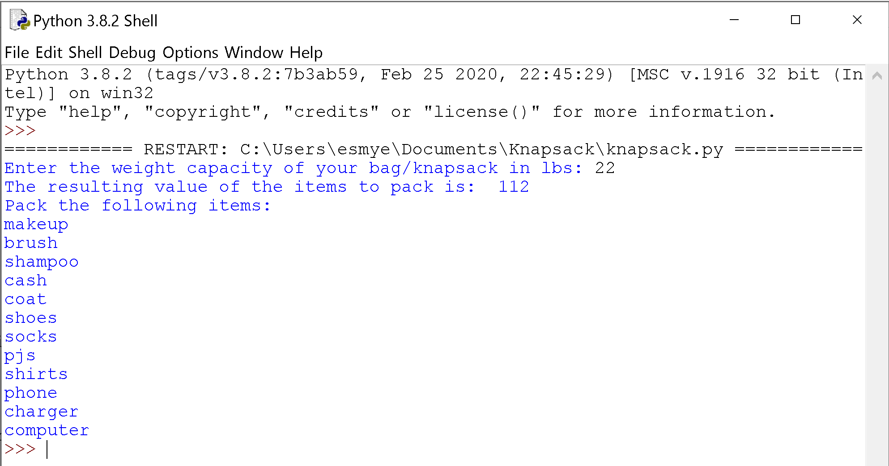

# Algorithms Extra Credit
A work by: Elizabeth Myers

## NP Problem: Knapsack Problem

### Description and Application
A real world problem that requires an NP algorithm to find its solution is the 0-1 Knapsack Problem. The Knapsack Problem is based off a set of request items _i_ and a knapsack with a weight capacity of _W_. Each request item _i_ has a weight and a value. The goal of the Knapsack Problem is to optimize the value in the knapsack by adding items without exceeding the weight limit of the knapsack itself. A more specific and applicable real-world case of the Knapsack Problem is the 0-1 Knapsack Problem. The "0-1" part of this problem means that each item will either be wholly accepted or rejected, rather than being able to take fractions or pieces of items being added. "0" means that the item was not added to the knapsack, while "1" means that the item was added to the knapsack. As mentioned before, this problem requires an NP algorithm to find its solution. The 0-1 Knapsack Problem can be solved using dynamic programming based on the capacity of the knapsack for a heuristic solution. 

The Knapsack Problem has importance and application to anyone who is traveling or taking a bag with them to another location, particularly when flying. Whether carry-on or checked-bags, airlines have restrictions on how heavy passengers' bags can be. This can often be a problem for travelers, particularly those like myself who do not want to have to pay high fees to check bags and are trying to fit all their essentials in a single carry-on bag. The 0-1 Knapsack Problem is important for travelers, as it allows them to assign a value of importance to their items along with its weight, and the solution of this problem can tell them which items they can bring with them while traveling without going over the weight limit. This solution for the problem will save travelers time and effort, for they would have to personally lay each item they are planning on taking with them out and individually choosing which to take with them while constantly weighing their bag to ensure they don't go over the weight limit. The solution would also save travelers money as they will not have to pay for a checked bag because their essentials are all in their carry-on, and they will not be charged for a bag that goes over the weight limit when being weighed before takeoff. 

For our problem, let us look at a specific real-world application of this problem. The following is true information and data, and when looking back on my trip planning, I realize that I would have saved myself a lot of stress and time if I had had a program to provide the solution to the knapsack issue I faced. One of my friends was studying abroad in Ireland, so I decided to plan a 5 day trip to see them and sight-see in Ireland. Because my roundtrip flight was over $800 and I was planning to stay for less than a week, I wanted to only bring a carry-on with me so I could save money and not have to drag two rolling suitcases around Ireland by myself. Because I had a limited amount of space in my suitcase and the airline I flew with, Aer Lingus, has a 10kg (~22lbs) carry-on weight limit, I had to pack my carry-on carefully with only the essentials. 


### Solution
The heuristic solution for the 0-1 Knapsack Problem that I will explore is the dynamic programming solution. In this solution, there are _n_ items given with each item having two integer array values, _val_[0..n-1] for the value of the item and _wt_[0..n-1] for the weight of the item. There is also an integer _cap_ which is the capacity of the knapsack. This algorithm finds the maximum value subset of the item values so the weights of these items added together is less than or equal to the knapsack capacity weight. Because this is the 0-1 Knapsack Problem, either an item is included in the optimal subset or it is not. 

To find this optimal subset from _n_ items, the program builds a two-dimentional array of _n+1_ x _cap+1_. Then, for every item _i_ and for every _wt_ of each of those items provided that the _cap_ of the knapsack is not exceeded, do the following and build the array further:
```
If there are no items or weights, then for that position the array is 0
Else if the _wt_ of the item is less than or equal to the weight capacity
  then find if the maximum _val_ we can obtain without the item _i_ or with item _i_, whichever is larger
Else the _wt_ of item _n_ is greater than the _cap_, so the item _n_ cannot be included
```
The idea of this solution is to find the largest value of items while still keeping the weight of these items at or under the knapsack capacity weight. These steps are iterated through until every item and its value is considered in the knapsack, and this breakdown of the overall problem into subproblems and storage of their results in the array so they don't need to be solved more than once causes this solution to be a dynamic programming one. The time complexity of this algorithm is O(nW), for the algorithm is repeated for the number of items _n_ and for the capacity of the knapsack _W_. This is also the array that is returned at the end of the solution.


The following is a screenshot of the resulting packing list when the _packingList.txt_ file included in this repository is run in the program solution:

